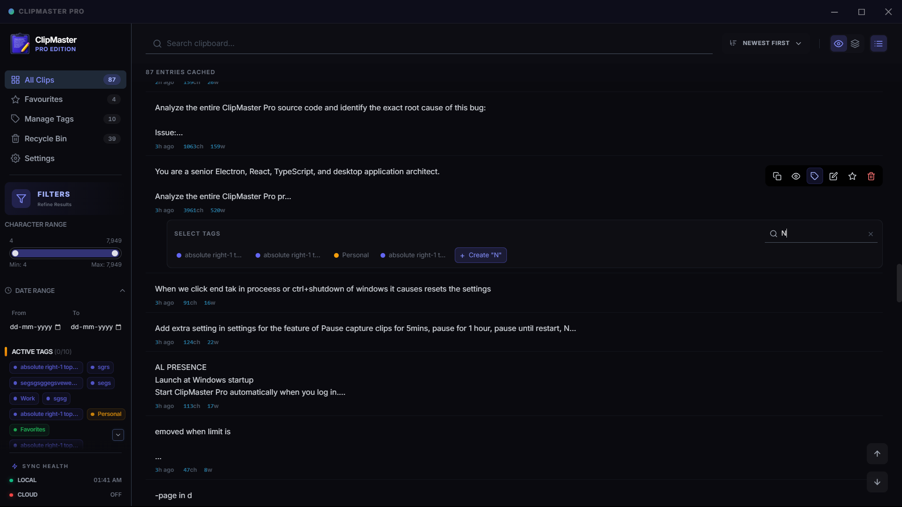
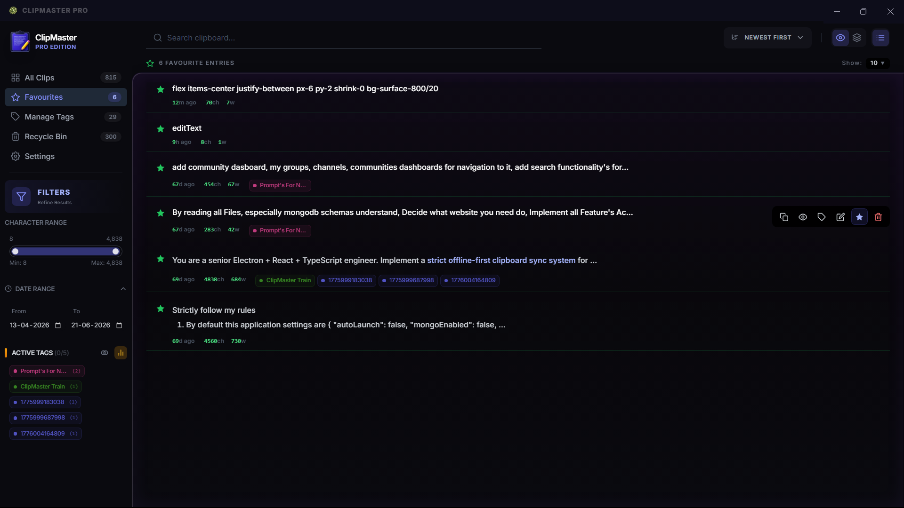
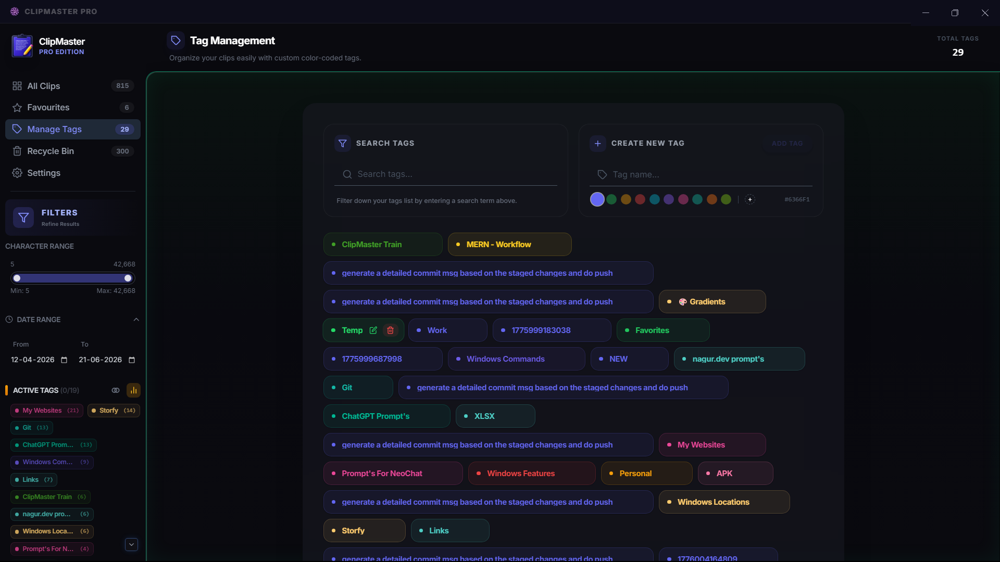
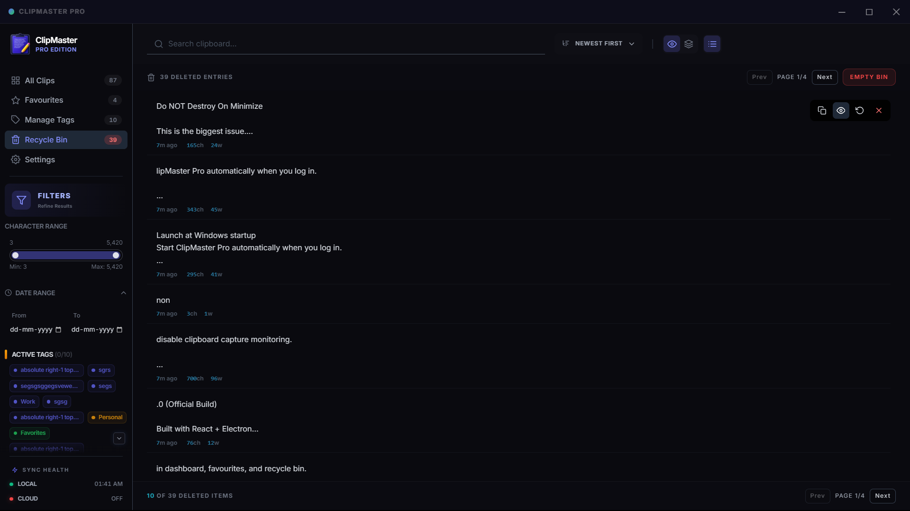
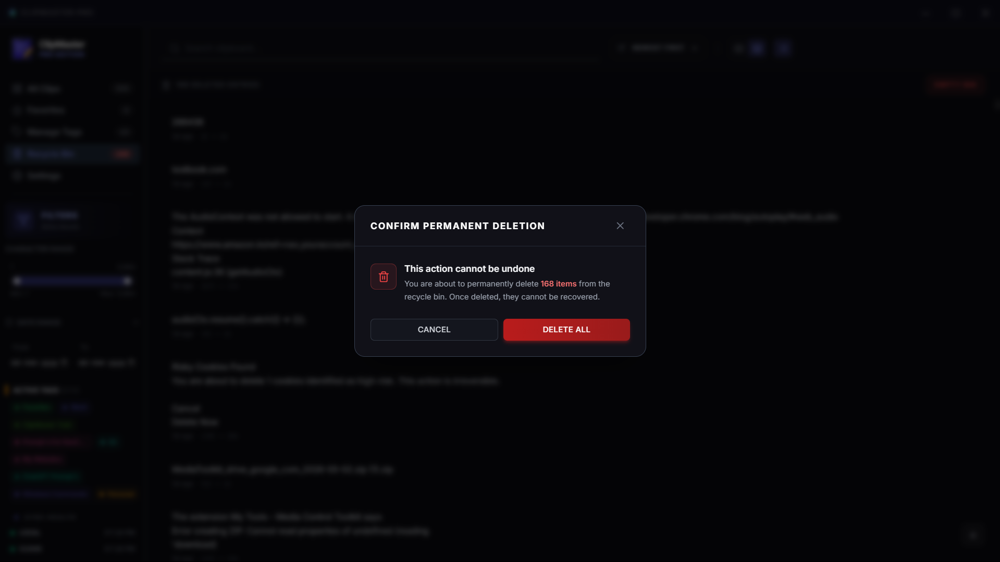
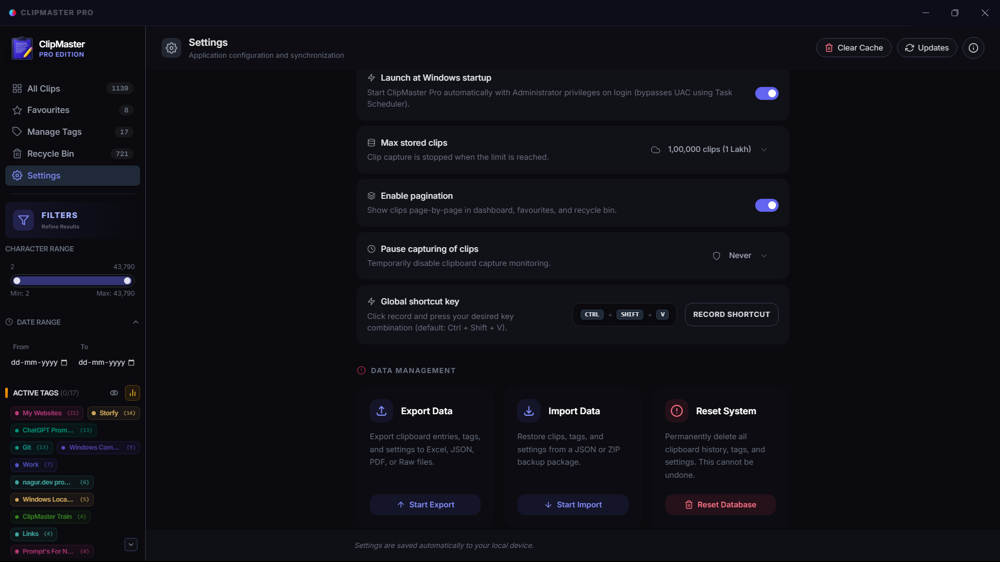

# ClipMaster Pro

**A fast clipboard manager for Windows** — Captures everything you copy, searchable and organized.

---

## Screenshots

  
  
  
  
  
  

---

## Core Features
- ⚡ **Auto-Capture & Privacy** — Instant clipboard monitoring with quick-pause options (15 mins, 30 mins, 1 hour, or until restart) for private sessions.
- 🔄 **Native Version Switcher** — Switch between historical versions and install updates directly from settings using native batch/shell script overwrites.
- 🔍 **Smart Search & Pagination** — Fast search with real-time result highlighting and responsive page-by-page rendering.
- 🏷️ **Advanced Tags & Favourites** — Color-coded tags, tag filters, and dedicated Favourites page to categorize and isolate clips.
- 🎨 **Premium UI & Shortcuts** — Modern interface featuring a quick-expand detail viewer dialog, system tray controls, and keyboard shortcuts (Ctrl + Delete to bypass recycle bin).
- 📦 **Hardened Persistence** — Crash-resilient atomic "write-then-rename" file operations with automatic `.bak` recovery to prevent settings reset on forced shutdown or system crash.

## Technical Highlights
- **Crash-Resilience**: Storage manager implements atomic operations and `fsync` so settings never revert during sudden app terminations (End Task, Ctrl+Shutdown).
- **System Integration**: Startup hidden flag (`--hidden`) and a system tray manager with quick settings toggles.
- **Keyboard Optimization**: Native shortcut detection (like `Ctrl` clicking Delete to permanently remove entries).
- **Milestone**: Version 2.3.0 complete with custom version switcher, native updater, and crash-resilient storage engine.

## Download & Install
- **[Setup Installer](https://github.com/Shaik-Nagur-Basha/ClipMaster-Pro/releases)** (85 MB) — Recommended for Windows users.
- **[Portable Version](https://github.com/Shaik-Nagur-Basha/ClipMaster-Pro/releases)** (40 MB) — No installation required.

## Documentation
- **[Release Notes](RELEASE_NOTES.md)** — Detailed v2.3.0 changelog.
- **[Quick Start](doc/QUICK_START.md)** — Setup in under 60 seconds.
- **[Architecture](doc/ARCHITECTURE.md)** — Technical breakdown of the app.
- **[Troubleshooting](doc/TROUBLESHOOTING.md)** — Common fixes and support.

---

## Requirements
- Windows 10+ | 512MB RAM | 150MB Disk

## License
MIT — © 2026 ClipMaster Pro Team
