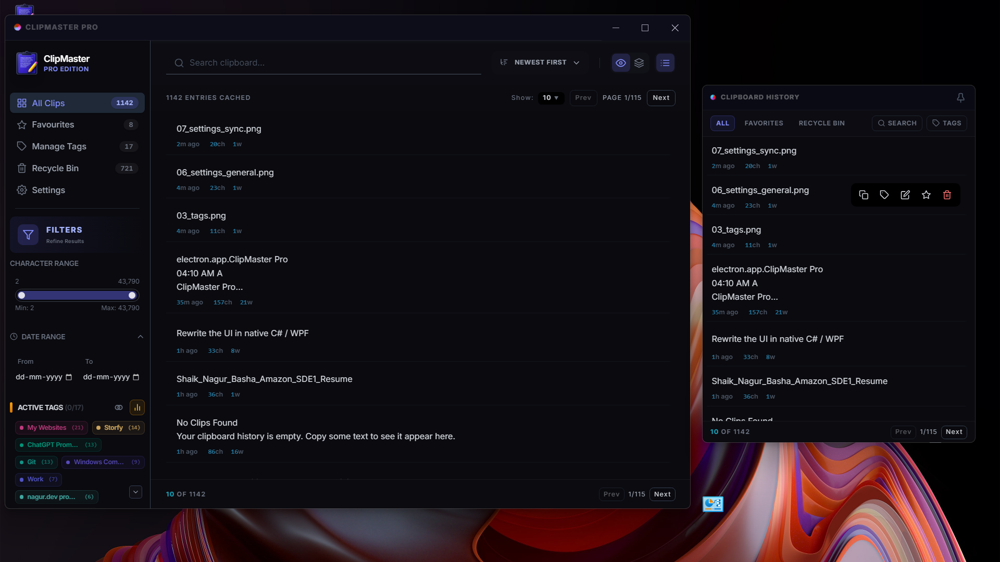

# ClipMaster Pro

**A fast clipboard manager for Windows** — Captures everything you copy, searchable and organized.

---

## Screenshots & Demo

  

  
  
  
  
  
  

### Watch the Demo Video
A video demonstration of ClipMaster Pro in action:
[Watch the Demo Video](screenshots/Clipmaster%20Pro%20Demo.mp4)

---

## What's New in v2.4.0 (Since v2.2.4)

Here is a list of the main features and enhancements introduced from v2.2.4 up to the current version:

- 🪟 **Overlay Popup Window** — A lightweight, borderless hover/overlay window with custom drag handles and quick tag filters, which doesn't steal taskbar space.
- ⚡ **Native C# Helpers** — Replaced resource-intensive background processes with optimized native C# executables (`clipboard-listener.exe` and `paster.exe`) to achieve near-zero idle CPU and RAM overhead.
- 📋 **Active Paste Injection** — Smart target window detection and focus switching; automatically restores focus and executes native paste operations. Supports "Pin & Close" behavior.
- 🔄 **Topmost Persistence** — High-frequency window positioning loop to lock the popup window as topmost during user dragging and interactions.
- ♾️ **Infinite Scroll & Loading Spinner** — Smooth, lag-free listing pages for All Clips, Favourites, and Recycle Bin with loading spinners when pagination is disabled.
- 🔢 **Custom Storage Limits & Lakh/Crore Formatting** — Support for custom maximum clip limits with Lakh/Crore formatting options.
- ⚙️ **Auto-Launch Optimizations** — Seamless background startup integration for both development and packaged installations.

---

## Core Features
- ⚡ **Auto-Capture & Privacy** — Instant clipboard monitoring with quick-pause options (15 mins, 30 mins, 1 hour, or until restart) for private sessions.
- 🔄 **Native Version Switcher** — Switch between historical versions and install updates directly from settings using native batch/shell script overwrites.
- 🔍 **Smart Search & Pagination** — Fast search with real-time result highlighting and responsive page-by-page rendering.
- 🏷️ **Advanced Tags & Favourites** — Color-coded tags, tag filters, and dedicated Favourites page to categorize and isolate clips.
- 🎨 **Premium UI & Shortcuts** — Modern interface featuring a quick-expand detail viewer dialog, system tray controls, and keyboard shortcuts (Ctrl + Delete to bypass recycle bin).
- 📦 **Hardened Persistence** — Crash-resilient atomic "write-then-rename" file operations with automatic `.bak` recovery to prevent settings reset on forced shutdown or system crash.

## Technical Highlights
- **Crash-Resilience**: Storage manager implements atomic operations and `fsync` so settings never revert during sudden app terminations (End Task, Ctrl+Shutdown).
- **System Integration**: Startup hidden flag (`--hidden`) and a system tray manager with quick settings toggles.
- **Keyboard Optimization**: Native shortcut detection (like `Ctrl` clicking Delete to permanently remove entries).
- **Milestone**: Version 2.4.0 complete with custom version switcher, native C# listener/paster helpers, overlay popup window, and infinite scroll.

## Download & Install
- **[Setup Installer](https://github.com/Shaik-Nagur-Basha/ClipMaster-Pro/releases)** (85 MB) — Recommended for Windows users.
- **[Portable Version](https://github.com/Shaik-Nagur-Basha/ClipMaster-Pro/releases)** (40 MB) — No installation required.

## Documentation
- **[Release Notes](doc/RELEASE_NOTES.md)** — Detailed v2.4.0 changelog.
- **[Quick Start](doc/QUICK_START.md)** — Setup in under 60 seconds.
- **[Architecture](doc/ARCHITECTURE.md)** — Technical breakdown of the app.
- **[Troubleshooting](doc/TROUBLESHOOTING.md)** — Common fixes and support.

---

## Requirements
- Windows 10+ | 512MB RAM | 150MB Disk

## License
MIT — © 2026 ClipMaster Pro Team
