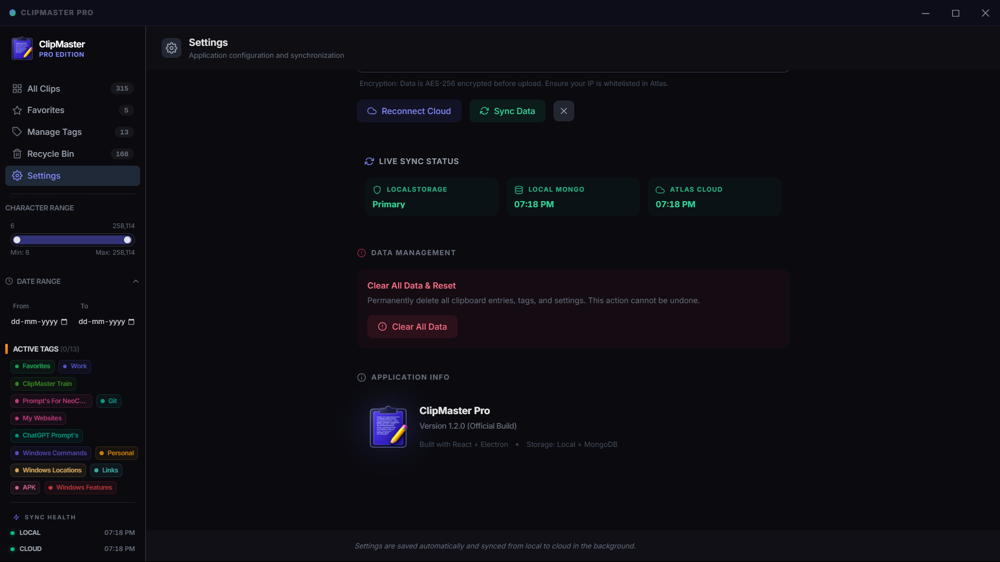

# ClipMaster Pro

**A fast clipboard manager for Windows** — Captures everything you copy, searchable and organized.

---

## Screenshots

  
  
  
  
  
  
  

---

## Core Features
- ⚡ **Auto-Capture** — Instant clipboard monitoring and history preservation.
- 🔍 **Smart Search** — High-performance search with real-time result highlighting.
- 🏷️ **Advanced Tags** — Categorize clips with tag management and filtering.
- 📦 **Data Integrity** — Hardened persistence with atomic writes and `.bak` recovery.
- 🎨 **Modern UI** — Responsive `EntryCard` components with `FormattedContent` (Markdown).
- 💾 **Cloud Sync** — Optional encrypted MongoDB backup.

## Technical Highlights
- **Architecture**: Modular `Sidebar` and `EntryCard` pattern for efficient clip management.
- **Display**: `FormattedContent` component supports code blocks and rich markdown rendering.
- **Optimization**: Hardened persistence strategy for system resilience during power loss.
- **Milestone**: Version 2.0.0 complete with full documentation and release templates.

## Download & Install
- **[Setup Installer](https://github.com/your-user/ClipMaster-Pro/releases)** (85 MB) — Recommended for Windows users.
- **[Portable Version](https://github.com/your-user/ClipMaster-Pro/releases)** (40 MB) — No installation required.

## Documentation
- **[Release Notes](RELEASE_NOTES.md)** — Detailed v2.0.0 changelog.
- **[Quick Start](doc/QUICK_START.md)** — Setup in under 60 seconds.
- **[Architecture](doc/ARCHITECTURE.md)** — Technical breakdown of the app.
- **[Troubleshooting](doc/TROUBLESHOOTING.md)** — Common fixes and support.

---

## Requirements
- Windows 10+ | 512MB RAM | 150MB Disk

## License
MIT — © 2026 ClipMaster Pro Team
